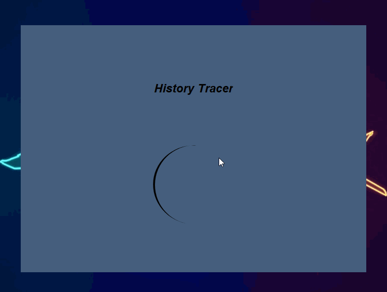

# History Tracer

> **`History Tracer`** is a desktop application that reads history data from different web browsers (Mozilla Firefox, Google Chrome, Microsoft Edge and Opera) and displays it in a table. It also allows you to view all files downloaded by the user and bookmarks saved. This tool analyzes the user's daily activity and then draws up a complete report on his digital presence.
This project was created with [Java](https://www.oracle.com/java/technologies/javase/jdk18-archive-downloads.html), JDK 18.0.2.1.

## User Stories

The following functionality is completed:
- [x] The system will allow the user to select a browser in order to display all the websites he has visited with certain information such as: his name, URL of sites, research titles, dates of visits, the duration of The latter as well as the number of visits for all the sites visited.
- [x]  It will show all the bookmarks saved by the user on the selected browser.
- [x] It will display all the files downloaded by the user.
- [x] The system establishes detailed reports on the digital presence of the user.
- [x] The user can enter texts to carry out research.
- [x] Online help, FAQ customer support will be made available to the user.

## Video Walkthrough

Here's a walkthrough of implemented user stories:

GIF created with `LiceCap`.

## Open-source ressources used
* Swing
* SQLite JDBC 
* JSON.simple
* Dom-2.3.0-jaxb
* JFreeChart
* JCommon

## Usage
To test the application, you must:
* Clone repository
* Run the main file

## License

    Copyright [2023] [John Clayton - UEspoir]

